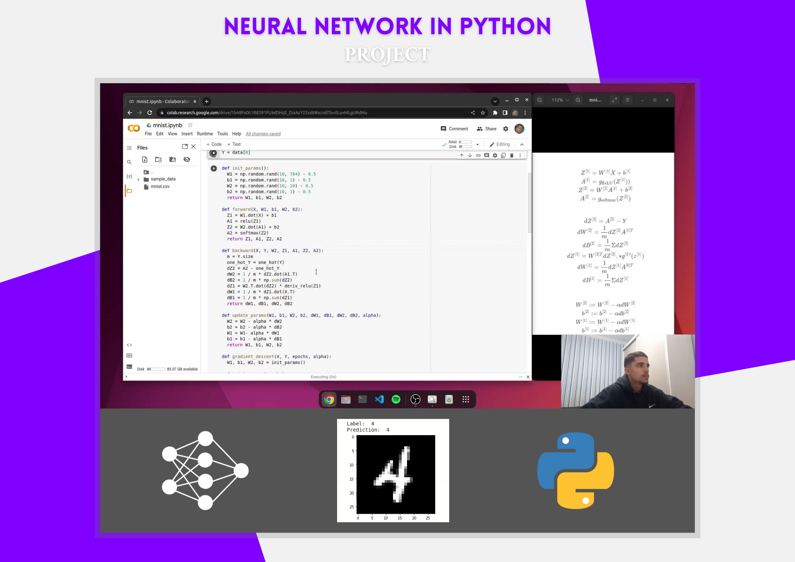

# Neural Network From Scratch
In this project, I developed a neural network in Python without any frameworks, such as PyTorch or Tensorflow. I did it to learn about a simple neural network's mathematics and background structure.
Besides, I trained the model in the MNIST dataset and finally tested its accuracy. The whole code is in the Jupyter notebook `mnist.py`.

  

## Project
You can check the Google Colab of the project in the [link](https://colab.research.google.com/drive/1b48FoDt1R8391FUWDHqS_ZsxAzY22cd8?usp=sharing).

## Video
You can check the video of the project explanation in the [link](https://bit.ly/bernardocodes).
